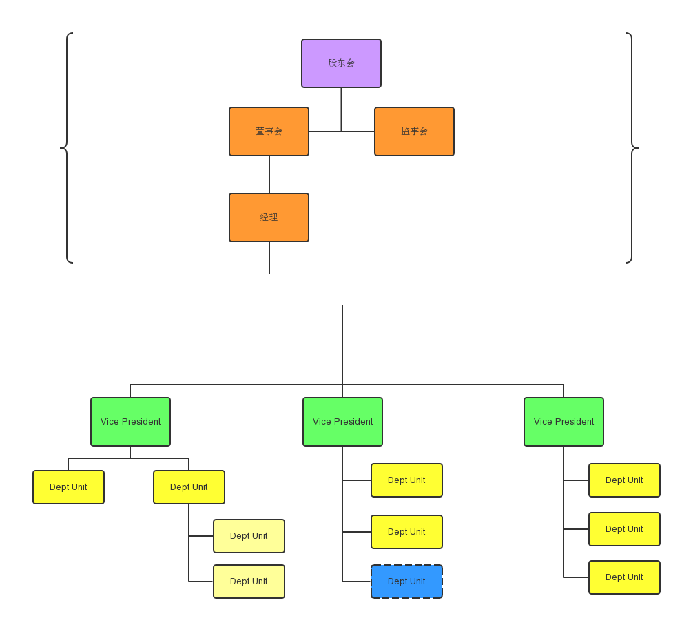

##实训班
管理体系设计和实施

###背景
在成熟的商业模式下，企业的管理体系也逐渐稳定，主要竞争方式是产品创新。当新的商业模式出现时，仅仅升级产品不能适应快速变化的竞争环境，企业的顶层规则也需要不断迭代更新。  
这种情况下，核心团队的使命发生了根本的改变。  

###名词解释
为了交流的准确性，本项目定义了一些“专用名词”：

* **核心团队**：专指公司的股东、董事、监事、经理，及其它企业种类的对应岗位。其它人员称为**外围团队**、**执行团队**。
</img>
* **核心职权**：专指核心团队的职权。其它职权称为**外围职权**。
* **企业集群**：由多个企业、自然人构成的共同体，企业种类可能包括公司、合伙企业等不同种类，各局部之间的契约也包括公开的、不公开的。在这个阶段，各企业的核心团队构成企业集群的核心团队。
* **管理体系**：本项目中专指**核心团队**的协作、分配规则和具体管理规章。它们包括书面的、口头的、甚至心理的契约，也包括公开的、不公开的。

###项目特点
1. 专注研究**核心团队**的协作、分配规则和具体管理规章；
2. 针对新的创业形势，强化了**管理体系**的可重构、可扩展、高透明度等特性；
3. 收集整理了一系列典型案例，针对常见错误精心设计模拟训练，帮助创业者克服障碍。

###能力结构
1. 在主要产品、商业模式迭代更新的同时，设计配套的公司章程、合伙协议；
2. 确保**执行团队**处于**核心团队**的有效管控之下，按照高度定制的管理接口运行；
3. 当单一企业无法适应发展需要时，能平滑过渡到**企业集群**模式；
4. 分析竞争对手的**管理体系**，针对其中缺陷制定我方竞争方案。

###课程介绍 
主要内容涉及以下专题：

* 章程规定：企业及合同法规，根据商业模式设计自己的“专属章程”。
* 筹备协议：正式工商设立前的临时协议、长期协议、特有问题及对策，不同企业种类及其异同。
* 融资机制：各种融资模式及其异同，给内部规章和产品加入原生的融资功能。
* 核心职权：驱动核心团队勤勉、自律地工作，积极学习提高，并安排合理的优胜劣汰。
* 外围衔接：核心团队与外围团队的脱节原因及对策，以及相关的专业工具。
* 业务孵化：成熟企业孵化新业务、新产品的常见障碍及解决方案。
* 新老团队：引入新业务需要的新核心团队，制定新老团队的协作和分配机制。
* 知识产权：知识产权的规划、申请、诉讼、经营（融资、转让、许可）等工作。

具体内容由讲师根据实际进度剪裁，如果筹备期的学员较多，实训时会以筹备协议、融资机制、核心职权这几个专题为主。
          
###课表安排
课号： 201606-3

* 地点：北京市（报名后另行通知）
* 6月17、18、19日 
* 上午8:00-11:00、下午13:00·15:30

###报名时间和付款方式 
1. 课号201606-3截止时间： 6月12日18:00
2. 请提前阅读[实训班成员协议](../contract/PSMD.WorkshopMember.md)，其中情况交底部分与报名邮件一同发来。纸质版在第一次课前交给讲师。
3. 报名步骤：
	1. JT持有者，直接支付JT。
	2. 人民币付款（请注明姓名）： 
		* 银行：
			* 开户行：交通银行北京上地支行  
			* 账户：110060974018010012087  
			* 户名： 北京学门科技有限公司  
		* 支付宝： huangyg@mars22.com 
		* 如果要发票：
			1. 付款账号的户主必须是发票抬头单位。
			2. 必须付给对公账户。
	3. 邮件确认：付款后把报名邮件发至 zhaoyh@xuemen.com ，请注明：  
		* 参加人姓名
		* 联系电话
		* Email地址（* 代他人报名或JT账号与发件邮箱不同时注明）
		* 课号
		* 成员协议中情况交底一节内容

###课程报价 
1. 价格：5760JT/人
2. 说明：含场地、资料、讲师费用。不包括交通和住宿。

###报名咨询
* 联系人：赵老师
* 手机：18611209810
* 邮件：zhaoyh@xuemen.com